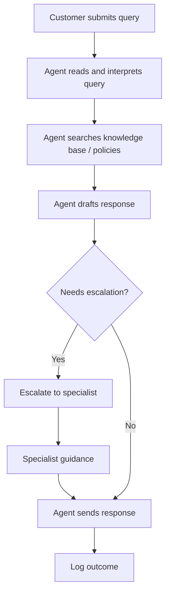
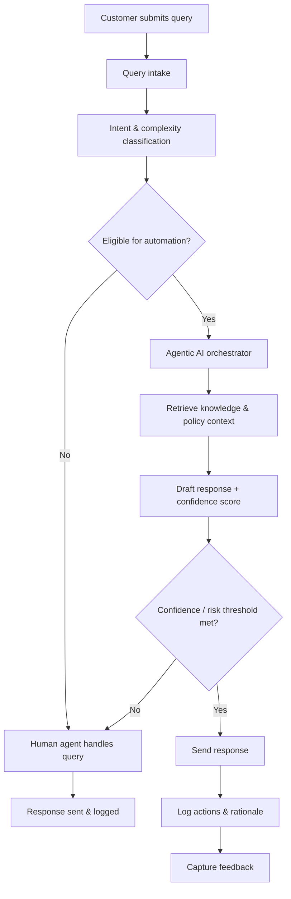
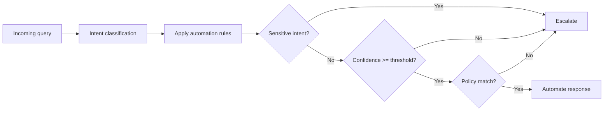
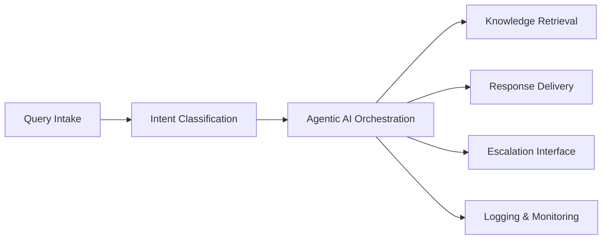

# Agentic AI Customer Service Automation System

## Purpose
This document defines the functional and technical specifications for an **agentic AI–based customer service automation system** designed to reduce manual query handling, improve response consistency, and increase operational efficiency.

The documentation supports implementation within an open-source environment and aligns business processes, system behaviour, and governance requirements.

---

## 1. System Overview

### 1.1 Background
Customer service teams commonly rely on manual processes to handle repetitive customer queries. This leads to increased handling times, inconsistent responses, and limited scalability.

The proposed system introduces **agentic AI** to autonomously manage routine customer queries while preserving human oversight for complex or high-risk interactions.

### 1.2 Objectives
- Automate handling of high-volume, low-complexity customer queries  
- Reduce average response and resolution times  
- Improve consistency and accuracy of responses  
- Enable agents to focus on complex customer interactions  
- Ensure transparency, auditability, and operational control  

---

## 2. Stakeholders and Users

| Stakeholder | Description |
|-------------|-------------|
| Customer Service Agents | Handle escalations and complex queries |
| Service Managers | Own customer service processes and performance |
| End Customers | Submit and receive responses to service queries |
| Open-Source Maintainers | Govern scope, quality, and roadmap |
| Contributors | Implement and maintain system components |

---

## 3. Scope Definition

### 3.1 In Scope
- Automated classification of customer queries  
- Autonomous response generation for eligible queries  
- Human-in-the-loop escalation workflows  
- Conversation context management  
- Logging, monitoring, and auditability  

### 3.2 Out of Scope
- Full replacement of human agents  
- Autonomous handling of sensitive or high-risk interactions  
- Execution of financial or contractual actions  

---

## 4. Process Diagrams (Mermaid)

### 4.1 AS-IS Process (Manual Handling)

### 4.2 TO-BE Process (Agentic AI + Human-in-the-loop)

### 4.3 Escalation Decision Logic

### 4.4 Conceptual Architecture

## 5. Functional Requirements
### 5.1 Query Intake and Classification

The system shall ingest customer queries from configured channels

The system shall classify queries by intent and complexity

The system shall determine automation eligibility

### 5.2 Agentic AI Behaviour

The system shall invoke an AI agent for eligible queries

The AI agent shall retrieve relevant knowledge base content

The AI agent shall maintain conversational context

### 5.3 Escalation and Human Oversight

Queries exceeding confidence or risk thresholds shall be escalated

Escalations shall be routed to appropriate human agents

Human agents shall be able to override AI-generated responses

### 5.4 Logging and Audit

All classifications, responses, and escalations shall be logged

Logs shall include timestamps, confidence scores, and actions taken

### 5.5 Decision Logic

Automation decisions shall consider complexity, confidence, sensitivity, and context

Automation rules shall be configurable without code changes

## 6. Non-Functional Requirements

Performance: responses meet defined latency thresholds

Accuracy: confidence scoring drives escalation

Security: role-based access and data privacy

Availability: high availability and horizontal scalability

Explainability: decisions are visible to agents

## 7. Assumptions and Constraints
Assumptions

Knowledge base is maintained by domain experts

Eligible query types are clearly defined

Constraints

Accuracy thresholds limit full automation

Open-source governance requires transparency

## 8. Success Metrics

Reduction in average handling time

% of queries resolved autonomously

Reduction in agent workload

Override and re-contact rates

## 9. Governance and Change Management

Automation rules are version-controlled

Threshold changes require approval

Performance is reviewed periodically

## 10. Exception Handling

Classification failures are escalated

Context failures are escalated

All errors are logged and traceable

## 11. Role of Business Analysis

This document reflects structured analysis of customer service workflows, stakeholder needs, and operational constraints, translating business problems into clear, testable system requirements.

License

This documentation is intended for open-source use and may be adapted under the terms of the project license.
